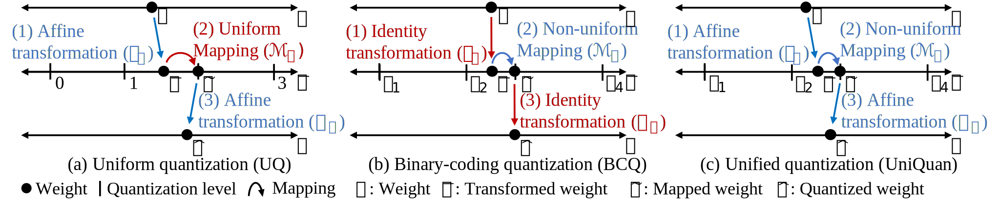

# Unifying Uniform and Binary-coding Quantization for Accurate Compression of Large Language Models
This package contains a PyTorch implementation of UniQuan<sub>F</sub>.
## Overview
### Overview of UniQuan<sub>F
<p align="center">F</sub>"></p>
   
**UniQuan<sub>F</sub>** (<u>**Uni**</u>fied <u>**Quan**</u>tization with <u>**F**</u>lexible Mapping) is an accurate quantization method for large language models (LLMs) without loss of accuracy.
We propose **UniQuan** (<u>**Uni**</u>fied <u>**Quan**</u>tization) which unifies the strong optimizability of uniform quantization (UQ) and the powerful expressiveness of binary-coding quantization (BCQ) through unifying their quantization process.
We propose **UniQuan<sub>F</sub>** by unifying FlexRound and ALTERNATING, the best-performing UQ and BCQ methods, respectively, based on **UniQuan**.


### Code Description
The following is an overview of our codes.
```
UniQuanF
│
│
├─  src                     : a directory for source codes
│   ├─ main.py              : a main code running UniQuanF
│   ├─ arguments.py         : descriptions for arguments
│   ├─ uniquanf.py          : codes for optimization
│   ├─ cached_loader.py     : codes for managing cached inputs
│   ├─ swap_linear.py       : codes for swapping linear layers into quantized ones
│   ├─ bcq_quant_layer.py   : codes for quantized linear layers
│   ├─ alternating.py       : an implementation of a general alternaing update
│   ├─ loss.py              : codes for loss functions
│   ├─ evaluation.py        : codes for comprehensive evaluation of quantized models. 
│   ├─ categories.py        : utility codes for general purpose
│   ├─ data_utils.py        : utility codes retaining to datasets
│   ├─ general_utils.py     : utility codes for general purpose
│   └─ evaluation_utils.py  : utility codes for evaluation
│
├─ scripts                  : a directory for script files
│   ├─ evaluate.sh          : a script file for evaluating the quanized model
│   └─ run.sh               : a script file for running UniQuanF
│
└─ README.md
```

## Prerequisite
### Install dependencies
The list of dependencies is as follows:
* python >= 3.10.12
* tqdm 4.66.5
* numpy 1.26.3
* torch 2.3.1
* datasets 2.21.0
* transformers 4.42.0

Install dependencies using the following command:
```shell
pip install -r requirements.txt
```
Additionally, install `lm-eval` package using the following command:
```shell
cd src/_eval/lm_evaluation_harness
pip install -e .
```
### Datasets
Our code automatically downloads the dataset needed when you run our `main.py` file except for MMLU. 
MMLU is located in `data/mmmlu/` directory and you don't have to manually download any datasets.

## Running
### Key arguments of UniQuan<sub>F</sub>
**Experimental settings**
* `model_name_or_path`: the path of the directory for the dense model
* `dataset_name`: the name of the sample dataset
* `num_samples`: the number of samples in the sample dataset
* `seed`: a random seed
* `n_bits_w`: a desired bit-width for weights
* `group_size`: the size of weight groups

**Hyperparameters of UniQuan<sub>F</sub>**
* `u_lr`: a learning rate for the quantization parameters of UQ
* `b_lr`: a learning rate for the quantization parameters of BCQ
* `iters_w`: the number of iterations for optimization
* `per_device_train_batch_size`: a batch size for optimization
* `period`: a remapping period (p)
* `grid_search_iters`: the number of iterations for grid search (G)
* `alternating_update_iters`: the number of iterations for an alternating update (T)

### A code for running UniQuan<sub>F</sub>
We provide the code for running UniQuan<sub>F</sub> as in `scripts/run.sh`. Run the script file as follows:
```shell
bash scripts/run.sh
```
If you want to evaluate the quantized model, use `evaluation.py` file as in `scripts/evaluate.sh`. Run the script file as follows:
```shell
bash scripts/evaluate.sh
```

## Reference
* [Transformers](https://github.com/huggingface/transformers/blob/main/examples/pytorch/language-modeling/run_clm.py)
* [Language Model Evaluation Harness](https://github.com/EleutherAI/lm-evaluation-harness.git)
* [OmniQuant](https://github.com/OpenGVLab/OmniQuant.git)
* [LoRA](https://github.com/microsoft/LoRA)
* [MMLU](https://github.com/hendrycks/test)

